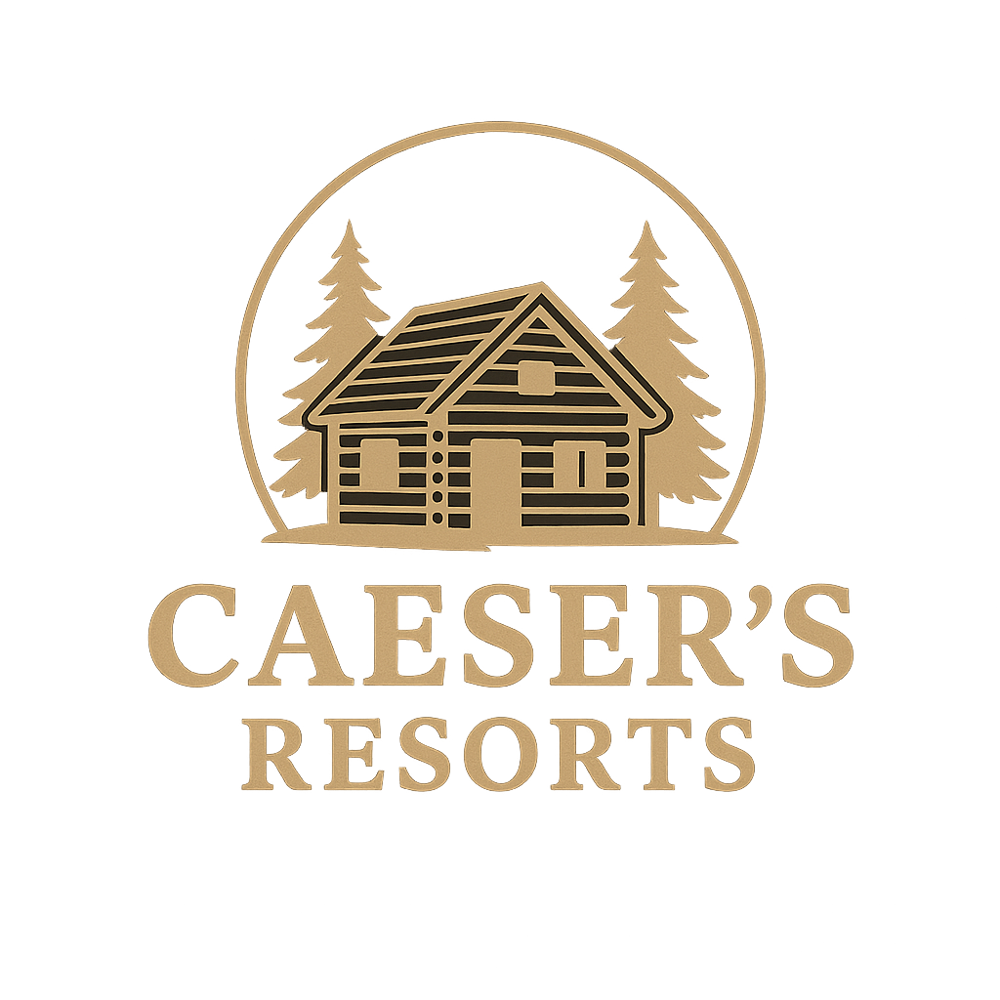
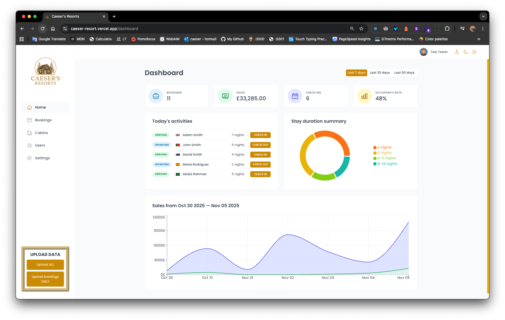

<!-- 
 -->
  

## Hotel Management App with Dashboard

A modern, responsive hotel management application built with React, TanStack Query, PostgreSQL, Supabase, and Recharts. Helps hotel staff manage bookings, guests, cabins, and daily operations, all from a single intuitive dashboard.

🔗 Live Demo: <https://caeser-resort.vercel.app>

  
  

### ✨ Features

Booking Management: View, create, update, and cancel reservations
Guest Profiles: Store and manage guest details securely
Cabin Inventory: Track cabin types, availability, and pricing
Real-time Stats: Visualise occupancy rates, revenue, and trends with Recharts
Data Sync: Fully powered by Supabase (PostgreSQL + Auth + Storage)
Reactive UI: Automatic data refetching & caching via TanStack Query
Responsive Design: Works seamlessly on desktop and tablet

### 🛠️ Tech Stack

Frontend: React 18, Vite, React Router
State & Data: TanStack Query (React Query)
Backend: Supabase (PostgreSQL, Authentication, Row-Level Security)
Charts: Recharts
Styling: CSS Modules / styled components
Deployment: Vercel

### 📊 Charts & Analytics

Powered by Recharts, the dashboard includes:

Daily/weekly occupancy rate
Revenue over time
Booking status distribution (confirmed, checked-in, checked-out)
🧪 Testing & Sample Data
The app includes a “Seed Data” utility (like your Uploader component) to populate the database with realistic test bookings, guests, and cabins for demo purposes.

📄 License
MIT © Caeser London

### 🙌 Feedback & Contributions

Feel free to open an issue or PR! This project is part of my portfolio as a Full Stack Developer focused on accessible, user-centred applications.
